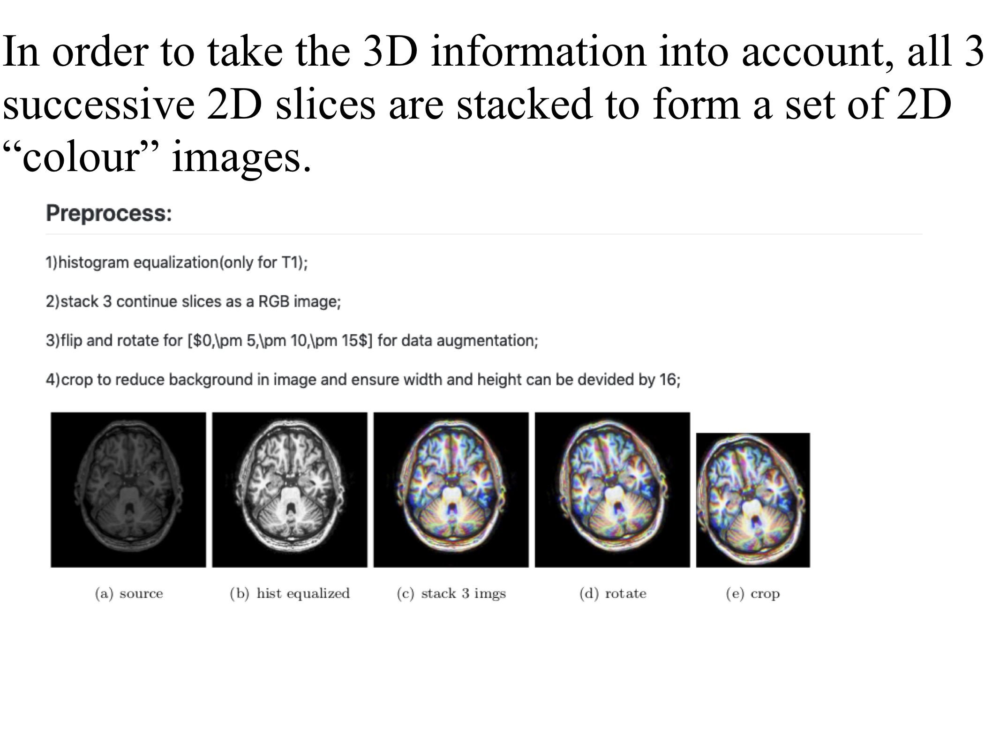
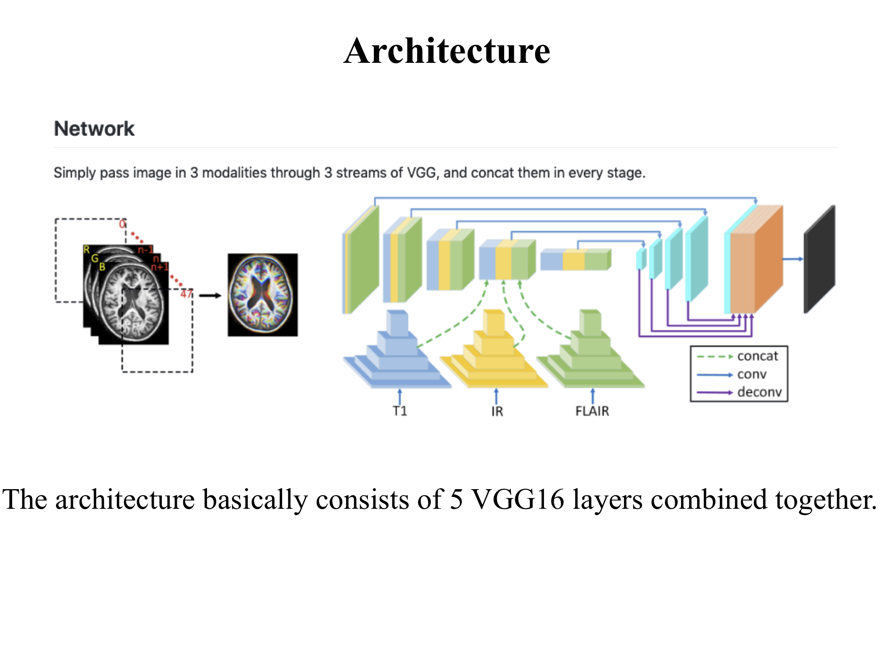
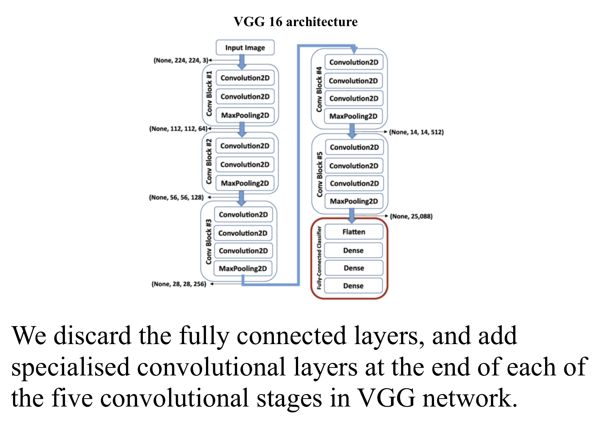
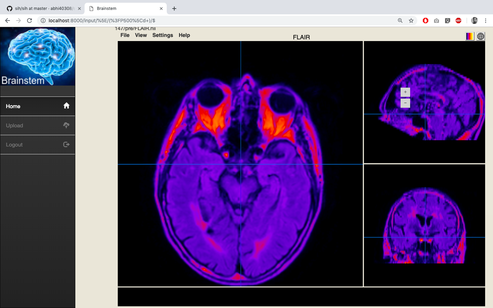
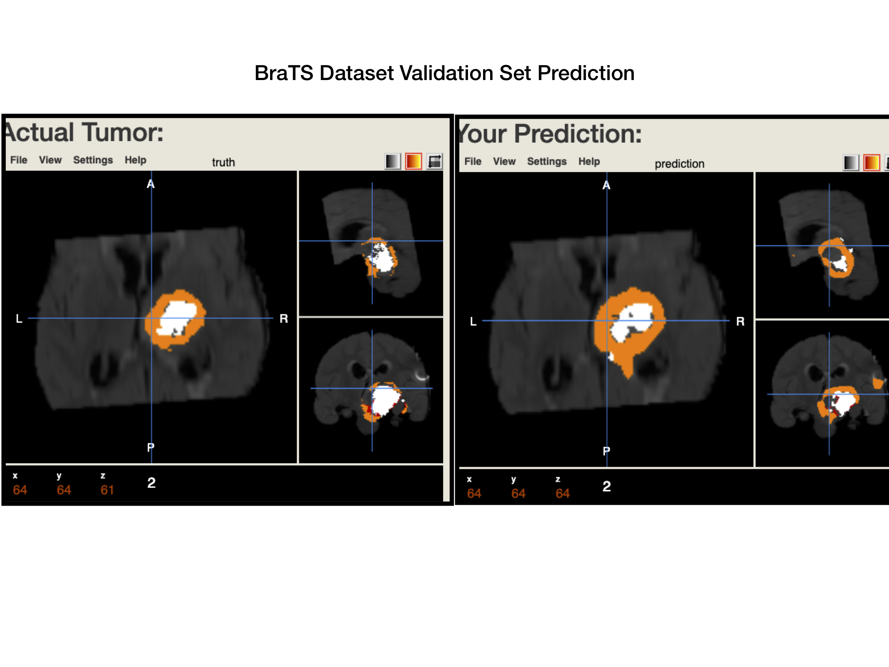
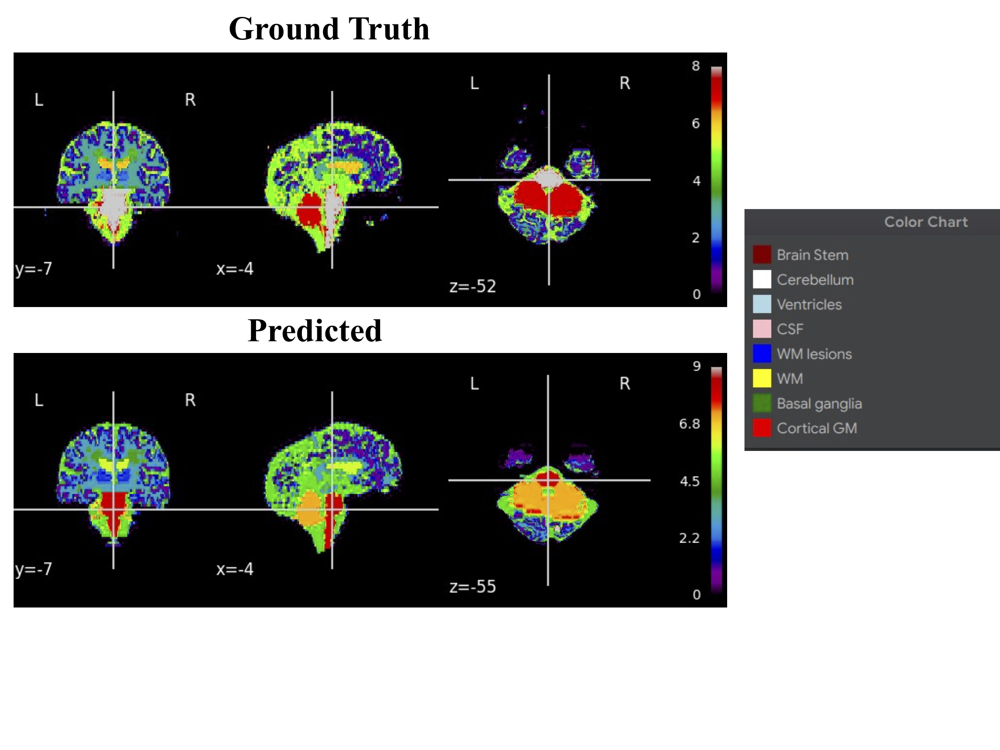

# Brain MRI Segmentation

The method we use comes from this paper:
[From neonatal to adult brain
mr image segmentation in a few seconds using 3d-like fully convolutional network and transfer learning](https://www.lrde.epita.fr/wiki/Publications/xu.17.icip)

Soft tissue segmentation.

This project was part of the Smart India Hackathon 2019 in which our team was the runner ups.
The problem statement was **Brain MRI Segmentation using Machine Learning** given by **Department of Atomic Energy, Government of India**

This project could be used by medical professionals for medical purposes.

## Preprocessing

## Why our model?

• Since we are using transfer learning, a novel approach in this field, so we do not need to train our model from scratch which makes it very fast in training in comparison to other models.

• Stacking 3 successive 2D slices allows us to make a RGB image, another novel idea.This representation enables us to incorporate some 3D information, while avoiding the expensive computational and memory requirements of fully 3D FCN.

• Using Transfer Learning we do not need many training images, so we could train our model very well only on a few training images.

• We are also using traditional data augmentation methods like rotating, cropping and flipping the images in training set for improving our model.

## GUI and giving input

## Output

## Tumour prediction

## Other regions

## Contributors 
[Vaibhav Shukla](https://github.com/vaibhavshukla182/)  
[Abhijeet Singh](https://github.com/abhi40308)  
[Omkar Ajnadkar](https://github.com/blackbird71SR)  
[Govind Singh Rajpurohit](https://github.com/govind51)  
[Ratna Priya](https://github.com/Ratna04priya)  
[Sanath Singavarapu](https://github.com/Killer2499)  
