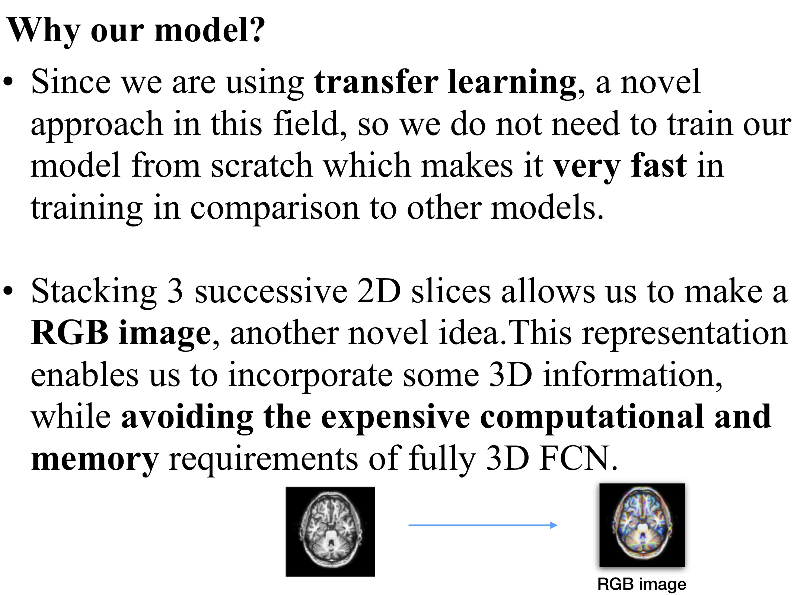
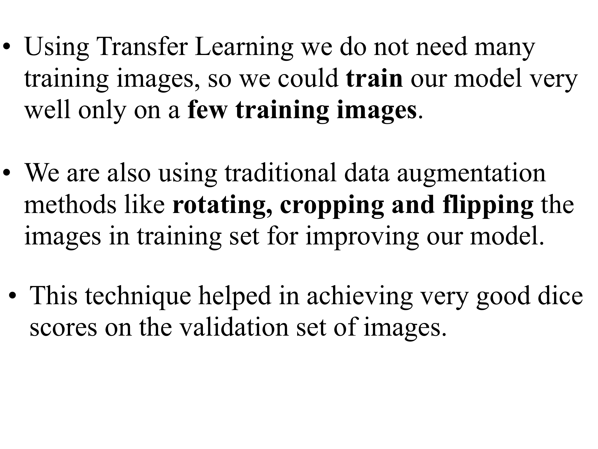

# Brain-MRI-Segmentation

The method we use comes from this paper:
[From neonatal to adult brain
mr image segmentation in a few seconds using 3d-like fully convolutional network and transfer learning](https://www.lrde.epita.fr/wiki/Publications/xu.17.icip)

This project was part of the Smart India Hackathon 2019 in which our team was the runner ups.
The probelm statement was **Brain MRI Segmentation using Machine Learning** given by **Department of Atomic Energy, Government of India**

## Preprocessing

## Tumour prediction

## Other regions

